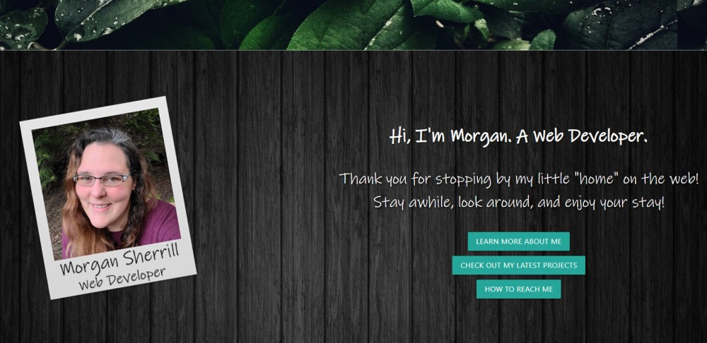
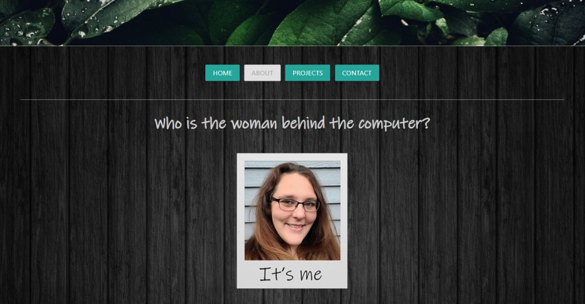
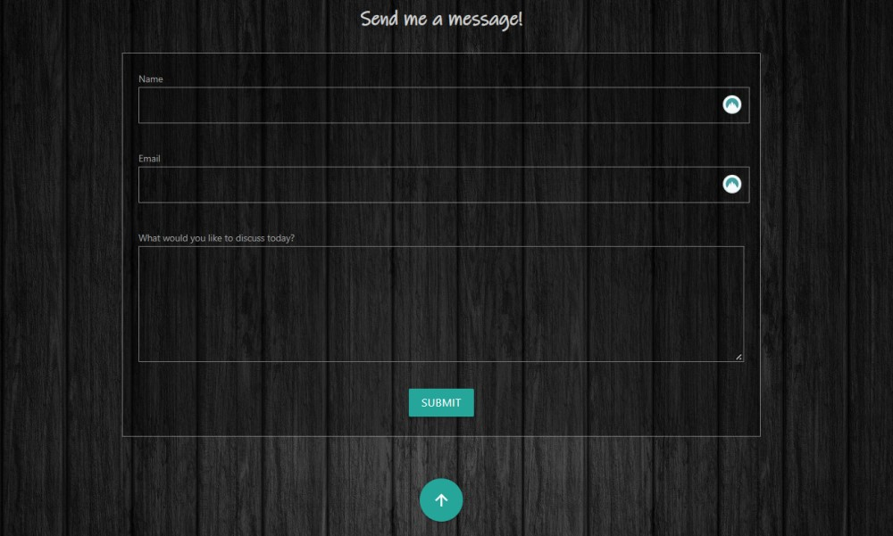

# React Portfolio

## Description

The objective of this assignment is to make my first react portfolio. I had a portfolio designed previously and was able to roughly take that design and incorporate it into a react application.

## Languages
- HTML
- CSS
- JS

#### With Help From
- React
- Materialize
- React Tool Tip
- Emailjs

## Link to GitHub main project page

[Project Page on GitHub](https://github.com/m-sherrill/React-Portfolio)

## Link to Deployed Application

[Live Deployed Link](https://m-sherrill.github.io/React-Portfolio/)

## Screenshots of Finished Product

Landing Page:

About Me Section:

Contact Form:

## Contact Information

Github: [@m-sherrill](https://github.com/m-sherrill)

Email: mo.sherrill@outlook.com

